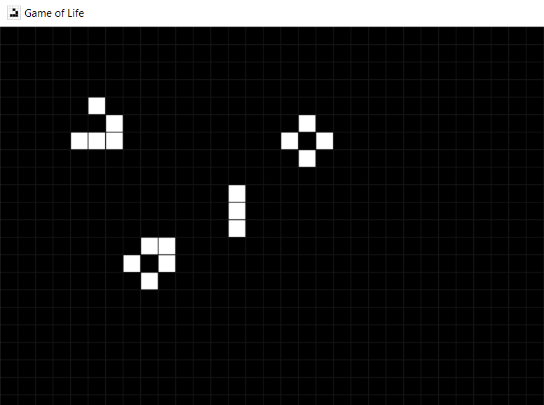

# Conway's Game of Life (Python)

My re-creation of Conway's Game of Life in Python, using Pygame.



## Features

- Virtually endless generations
- Pause, replay, and restart generations
- Toroidal grid allowing wraparound
- Keyboard and mouse controls

## Table of Contents

- [Installation](#installation)
- [Game Rules](#game-rules)
- [Controls](#controls)
    - [Selection Mode](#selection-mode-controls)
    - [Generation Mode](#generation-mode-controls)
- [Examples](#examples)

## Installation

1. Clone the repository:
    ```bash
    git clone https://github.com/VarunVF/game-of-life-pygame.git game-of-life
    cd game-of-life
    ```
2. Install dependencies using pip:
    ```bash
    pip install pygame
    ```

3. Run the simulation:
    ```bash
   python life.py
    ```

## Game Rules

1. **Underpopulation**: Any live cell with fewer than two live neighbors dies.
2. **Survival**: Any live cell with two or three live neighbors survives.
3. **Overpopulation**: Any live cell with more than three live neighbors dies.
4. **Reproduction**: Any dead cell with exactly three live neighbors becomes a live cell.

## Controls

Initially, the game enters Selection Mode.
You can switch between Selection Mode and Generation Mode,
and perform other similar actions, using the following controls. 

### Selection Mode Controls

| Control        | Action                   |
|----------------|--------------------------|
| Left-click     | Select Cell              |
| Right-click    | Deselect Cell            |
| Escape         | Clear all selected cells |
| Enter (Return) | Enter Generation Mode    |

### Generation Mode Controls

| Control | Action                                              |
|---------|-----------------------------------------------------|
| Space   | Pause generation, <br/> enter Selection Mode        |
| R       | Reset to original state, <br/> enter Selection Mode |

## Examples

Here are a few patterns you can try:
- **Glider**: A pattern that moves diagonally.
- **Still Life**: Patterns that do not change over time, like the Block or Beehive.
- **Oscillator**: Patterns that repeat after a fixed number of steps, such as the Blinker or Toad.